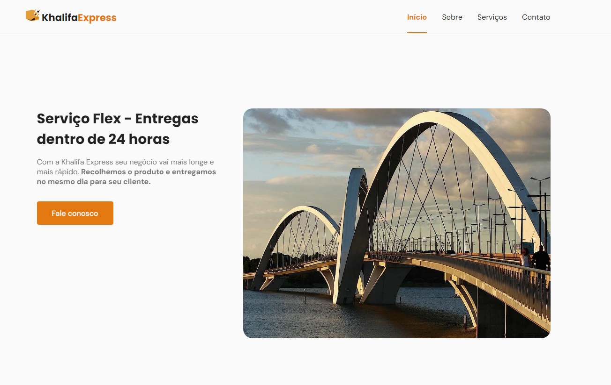

Aplicação desenvolvida como Projeto freelance

# Khalifa Xpress - Envios Flex 

O projeto é um site modelo de lading page para uma empresa de envios Flex.
Esse é um dos meus projetos freelance 

##  Tecnologias usadas no projeto

## Link da aplicação

👉🏼[Clique aqui para accessar](https://khalifa-express.netlify.app/)

## 🔗 Deploy 

## 💻 Sobre mim 😄
 Estudante de Engenharia de Software na UNOPAR e 
 Desenvolvedor Front End estudando na Rocketseat dentro do Programa Explorer 

## 🔗 Contato 

